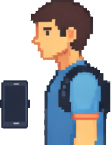

# Sistema de Correcao de Postura com MPU6050 + OLED SSD1306

Projeto de sistema embarcado em Arduino para monitorar postura em tempo real. O Arduino le um sensor MPU6050, calcula o angulo de inclinacao, mostra o estado em um display OLED SSD1306 e aciona um LED quando a postura passa do limite configurado.

Agora o projeto tambem inclui um broker local, um app web responsivo e um dashboard para visualizar as leituras.

## Componentes

- `sketch.ino`: firmware do Arduino Uno. Mantem leitura do MPU6050, OLED e LED no pino 8.
- `broker/broker.py`: broker local em Python, sem dependencias externas obrigatorias.
- `broker/serial_bridge.py`: ponte opcional para ler o Serial do Arduino e enviar ao broker.
- `dashboard/`: painel de monitoramento em tempo real.
- `app/`: app web responsivo para acompanhar leituras e enviar testes simulados.

## Hardware

- Arduino Uno
- MPU6050 via I2C
- Display OLED SSD1306 128x64 no endereco `0x3C`
- LED vermelho no pino digital `8` com resistor de 220 ohms

As bibliotecas do Arduino continuam listadas em `libraries.txt`:

- `MPU6050`
- `Adafruit GFX Library`
- `Adafruit SSD1306`

## Como funciona a integracao

O Arduino continua funcionando sozinho mesmo sem rede. A cada segundo ele escreve uma linha JSON no Serial:

```json
{"deviceId":"postura-uno","angleX":12.35,"limit":20.0,"alert":false,"status":"ok"}
```

Essa saida foi feita para sistemas embarcados: simples, leve, textual e facil de enviar por Serial, Bluetooth, Wi-Fi, ESP8266/ESP32 ou qualquer gateway.

## Rodar o broker, app e dashboard

Com Node.js, que ja esta disponivel nesta maquina:

```powershell
npm start
```

Ou diretamente:

```powershell
node broker\broker.js
```

Se preferir Python:

No terminal, dentro da pasta do projeto:

```powershell
python broker\broker.py
```

Depois abra:

- Dashboard: `http://127.0.0.1:8000/dashboard/`
- App: `http://127.0.0.1:8000/app/`
- API ultima leitura: `http://127.0.0.1:8000/api/latest`

O app tambem tem botoes de teste para simular leituras sem o Arduino conectado.

## Usar com Arduino real via USB

1. Grave o `sketch.ino` no Arduino.
2. Inicie o broker:

```powershell
python broker\broker.py
```

3. Em outro terminal, instale a dependencia da ponte serial se ainda nao tiver:

```powershell
python -m pip install pyserial
```

4. Rode a ponte serial trocando `COM3` pela porta do seu Arduino:

```powershell
python broker\serial_bridge.py --port COM3
```

## Enviar dados por HTTP

Qualquer gateway embarcado pode publicar no broker com:

```http
POST /api/telemetry
Content-Type: application/json

{"deviceId":"postura-uno","angleX":25.4,"limit":20,"source":"wifi"}
```

## Enviar dados por TCP

O broker tambem escuta linhas JSON em `127.0.0.1:1883`. Isso nao implementa MQTT completo; e um canal simples de ingestao para projetos embarcados que enviam uma linha JSON por leitura.

## Como implantar na Nuvem (Render)

Este projeto está pronto para ser implantado gratuitamente no [Render](https://render.com/). O broker web hospedará o Dashboard, o App e receberá os dados de telemetria de qualquer lugar do mundo.

### Passo a passo para o Deploy:

1. Garanta que as alterações recentes estão no seu repositório do **GitHub**.
2. Acesse o [Render](https://render.com/) e faça login usando seu GitHub.
3. No painel do Render, clique em **New +** (canto superior direito) e escolha **Web Service**.
4. Conecte o seu repositório do projeto **CorretorDePostura**.
5. Configure os seguintes campos do serviço:
   - **Name:** `corretor-de-postura` (ou o nome que preferir)
   - **Branch:** `correcao-redirecionamento-broker` (ou a branch correspondente)
   - **Runtime:** `Node`
   - **Build Command:** Deixe em branco ou `npm install`
   - **Start Command:** `npm start`
   - **Instance Type:** Escolha o plano **Free** (Grátis)
6. Clique em **Deploy Web Service**.

Após a conclusão do build, uma URL pública será gerada (ex: `https://corretor-de-postura.onrender.com`).
Suas páginas e APIs estarão acessíveis em:
- Dashboard: `https://corretor-de-postura.onrender.com/dashboard/`
- App Simulador: `https://corretor-de-postura.onrender.com/app/`
- Enviar telemetria (HTTP): `https://corretor-de-postura.onrender.com/api/telemetry`

> [!NOTE]
> No plano gratuito do Render, apenas tráfego HTTP é exposto publicamente para a internet. A porta TCP (`1883`) funciona apenas localmente. O ESP32 ou outros microcontroladores devem enviar dados usando o endpoint HTTP (`POST /api/telemetry`).

## Objetivo

Promover consciencia corporal e auxiliar na correcao de posturas inadequadas com um prototipo simples, acessivel e extensivel para sistemas embarcados.

## Demonstracao



## Licenca

Este projeto esta sob a licenca [MIT](LICENSE).
